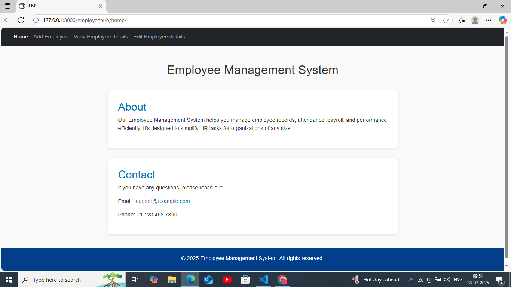
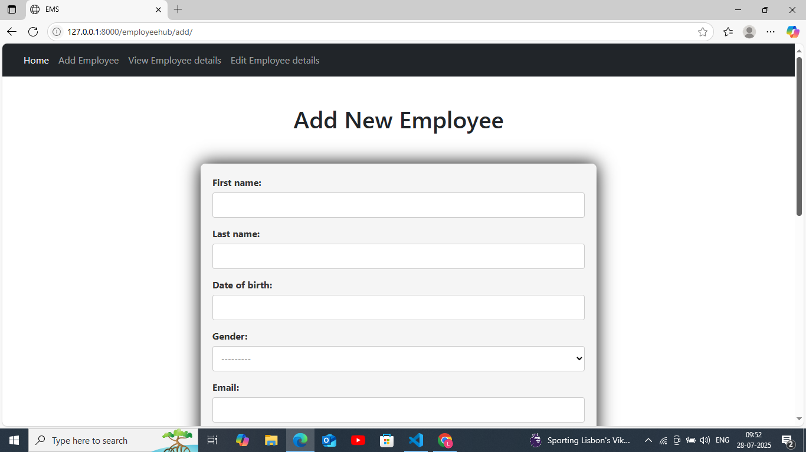
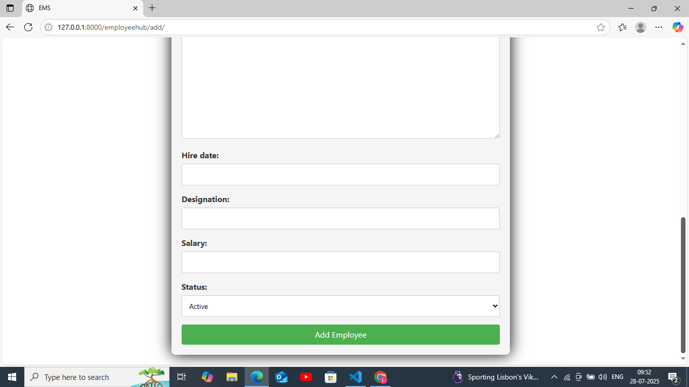
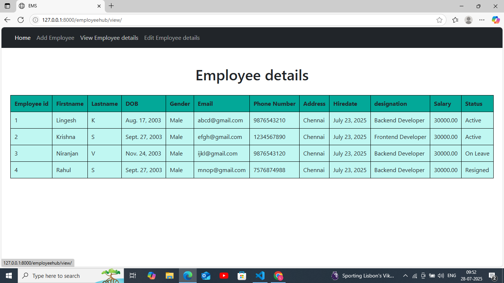
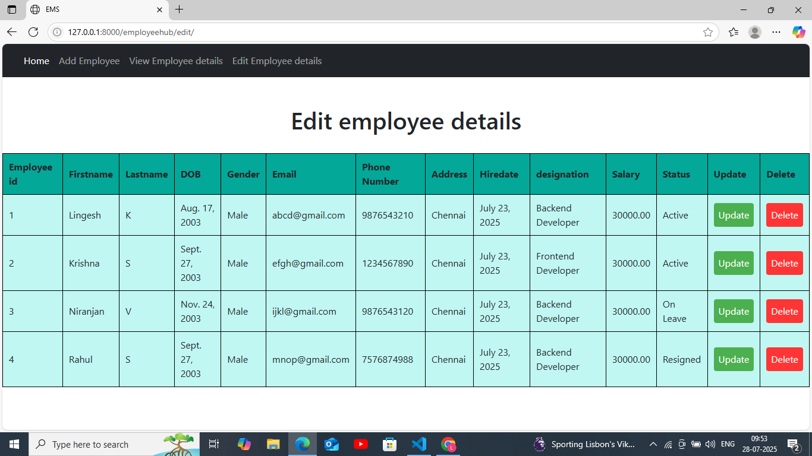

# Employee Management System (EMS)

## ✅ Overview
A Django-based Employee Management System to manage employee records efficiently.

## ✨ Features
- Add, update, and delete employee records.
- Manage employee details through the Django admin interface.
- Clean project structure following Django conventions.
- Uses Django models, forms, and views for CRUD operations.

## ⚙️ Requirements
- Python 3.x
- Django (compatible version)

## 🚀 Setup Instructions

```bash
# 1️⃣ Clone the repository
git clone <https://github.com/K-Lingesh/EMS-Employee_Management_System.git>
cd EMS-Employee_Management_System-main

# 2️⃣ Create virtual environment (optional but recommended)
python -m venv venv
source venv/bin/activate  # On Windows: venv\Scripts\activate

# 3️⃣ Install dependencies
pip install django

# 4️⃣ Run migrations
python manage.py migrate

# 5️⃣ Create superuser (for admin access)
python manage.py createsuperuser

# 6️⃣ Start the development server
python manage.py runserver

# 7️⃣ Open in your browser
http://127.0.0.1:8000/
```
## 📷 Screenshots
### 🏠 Home Page


### ➕ Add Employee Page



### 📋 View Employees Page


### ✏️ Edit Employee Page


