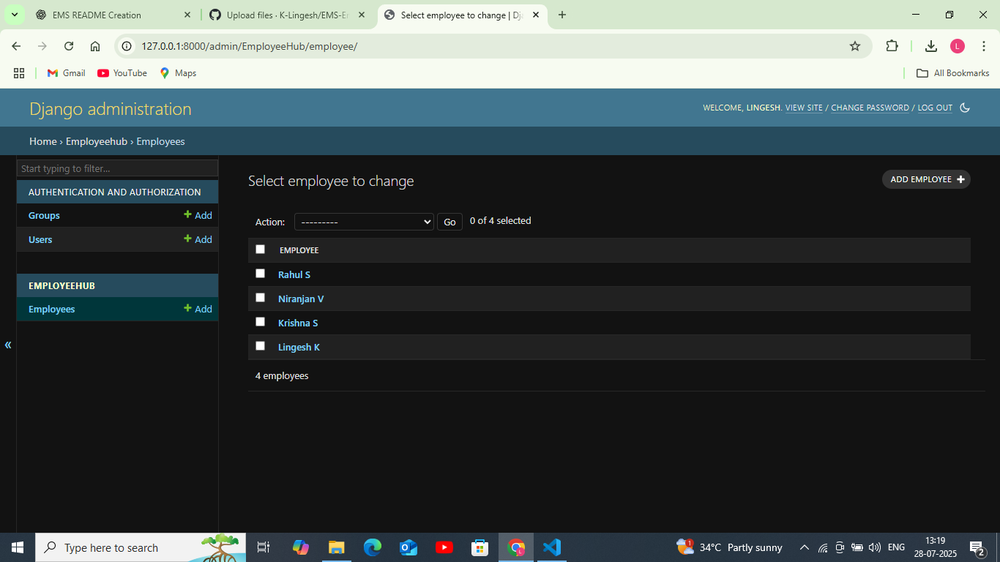

# Employee Management System (EMS)

## ✅ Overview
A Django-based Employee Management System to manage employee records efficiently.

## ✨ Features
- Add, update, and delete employee records.
- Manage employee details through the Django admin interface.
- Clean project structure following Django conventions.
- Uses Django models, forms, and views for CRUD operations.

## ⚙️ Requirements
- Python 3.x
- Django (compatible version)
- Bootstrap v5

## 🚀 Setup Instructions

1️⃣ Clone the repository
```bash
git clone <https://github.com/K-Lingesh/EMS-Employee_Management_System.git>
cd EMS-Employee_Management_System-main
```

2️⃣ Create virtual environment
```bash
python -m venv venv
source venv/bin/activate  # On Windows: venv\Scripts\activate
```

3️⃣ Install dependencies
```bash
pip install django
```

4️⃣ Run migrations
```bash
python manage.py migrate
```

5️⃣ Create superuser (for admin access)
```bash
python manage.py createsuperuser
```

6️⃣ Start the development server
```bash
python manage.py runserver
```

7️⃣ Open in your browser
```bash
http://127.0.0.1:8000/
```

## 📷 Screenshots

### 🔑 Admin Panel Page


### 🏠 Home Page


### ➕ Add Employee Page


### 📋 View Employees Page


### ✏️ Edit Employee Page


